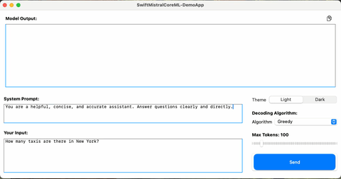

# SwiftMistralCoreML

An open-source Swift library that enables macOS and iOS projects to utilize the Mistral-Interact7B models (INT4 and upcoming FP16) in chat mode. This library includes a complete Swift implementation of the tokenizer and Byte Pair Encoding (BPE) encoder, providing an out-of-the-box solution for integrating advanced language models into your Swift applications.

## Features

- **Full Swift Implementation**: Includes tokenizer and BPE encoder written entirely in Swift.
- **CoreML Integration**: Leverages Apple's CoreML framework to run Mistral-Interact7B models efficiently.
- **Multiple Decoding Strategies**: Supports Greedy and Top-K sampling, with plans to add more strategies.
- **Chat Functionality**: Designed to work in chat mode for interactive applications.
- **FP16 Support (Coming Soon)**: Future version will support FP16 models for improved performance.
- **iOS Compatibility**: Aiming for compatibility with iOS 18 and newer.
- **Extensible Interface**: Future improvements will focus on enhancing flexibility and adding more features.

## Important Note

**The Mistral-Interact7B CoreML model is not included in this library.** You must download the model from [Hugging Face](https://huggingface.co/apple/mistral-coreml) and add it to your project manually.


[Download Here The Demo App](https://github.com/cardona/SwiftMistralCoreML-DemoApp)



## Installation

Add `SwiftMistralCoreML` to your project using Swift Package Manager:

1. In Xcode, go to **File > Swift Packages > Add Package Dependency**.
2. Enter the repository URL:
   ```
   https://github.com/cardona/SwiftMistralCoreML.git
   ```
3. Choose the latest version and follow the prompts to add the package.

## Model Setup

1. Download the Mistral-Interact7B CoreML model (INT4 or FP16) from [Hugging Face](https://huggingface.co/apple/mistral-coreml).
2. Drag and drop the downloaded `.mlmodel` file into your Xcode project.

## Usage

Here's how to use `SwiftMistralCoreML` in your project:

### Import the Library

```swift
import SwiftMistralCoreML
```

### Define the Parameters

Create an instance of `MistralParameters` to specify the model's behavior:

```swift
let parameters = MistralParameters(
    userInput: "Hello, how are you?",
    systemPrompt: "You are a helpful assistant.",
    algorithm: .greedy,
    maxTokens: 500,
    topK: nil  // Not required for Greedy decoding
)
```

### Generate Text

Use the `TextGenerator` class to generate responses:

```swift
let tokenizerParser = try TokenizerParser()
let bpeEncoder = BPEEncoder(tokenizerParser: tokenizerParser)
let textGenerator = try TextGenerator(bpeEncoder: bpeEncoder, tokenizerParser: tokenizerParser)

let messages = [
    Message(role: .system, content: parameters.systemPrompt),
    Message(role: .user, content: parameters.userInput)
]

let mistralInput = try MistralInput(messages: messages, bpeEncoder: bpeEncoder, tokenizer: tokenizerParser)

let generatedText = try await textGenerator.generateText(
    from: mistralInput.inputTokens,
    using: parameters,
    progressHandler: { generatedWord in
        print(generatedWord)
    }
)

print("Assistant: \(generatedText)")
```

## Example

Below is a complete example of how to integrate and use the library:

```swift
import SwiftMistralCoreML

final class MistralChat {
    private var messages: [Message] = []

    func startChat() async {
        do {
            let parameters = MistralParameters(
                userInput: "Tell me a joke.",
                systemPrompt: "You are a witty assistant.",
                algorithm: .greedy,
                maxTokens: 50,
                topK: nil
            )

            let tokenizerParser = try TokenizerParser()
            let bpeEncoder = BPEEncoder(tokenizerParser: tokenizerParser)
            let textGenerator = try TextGenerator(bpeEncoder: bpeEncoder, tokenizerParser: tokenizerParser)

            messages.append(Message(role: .system, content: parameters.systemPrompt))
            messages.append(Message(role: .user, content: parameters.userInput))

            let mistralInput = try MistralInput(messages: messages, bpeEncoder: bpeEncoder, tokenizer: tokenizerParser)

            let generatedText = try await textGenerator.generateText(
                from: mistralInput.inputTokens,
                using: parameters,
                progressHandler: { generatedWord in
                    print(generatedWord, terminator: "")
                }
            )

            messages.append(Message(role: .assistant, content: generatedText))
            print("\nAssistant: \(generatedText)")
        } catch {
            print("Error: \(error.localizedDescription)")
        }
    }
}

let chat = MistralChat()
Task {
    await chat.startChat()
}
```

## Decoding Algorithms

The library supports multiple decoding algorithms:

- **Greedy Decoding**: Selects the token with the highest probability at each step.
- **Top-K Sampling**: Samples the next token from the top K most probable tokens.

Specify the algorithm when creating `MistralParameters`:

```swift
let parameters = MistralParameters(
    userInput: "What's the weather like today?",
    systemPrompt: "",
    algorithm: .topK,
    maxTokens: 500,
    topK: 10  // Required for Top-K decoding
)
```

## Planned Features

- **FP16 Model Support**: Upcoming support for FP16 models, providing better accuracy and performance.
- **More Decoding Strategies**: Planned addition of new decoding strategies such as Beam Search and Temperature Sampling.
- **Enhanced Compatibility**: Ensuring the library is fully compatible with iOS 18 and supports iPhone devices.
- **Interface Improvements**: Ongoing improvements to the API for better ease of use and flexibility.

## Customization

You can extend the library to support additional features or models. The modular design allows you to replace components like the decoding strategy or tokenizer as needed.

## Contributing

Contributions are welcome! Please open an issue or submit a pull request on the [GitHub repository](https://github.com/cardona/SwiftMistralCoreML).

## License

This project is licensed under the Apache 2.0 License.

---

*Created because there were no existing examples on how to use Mistral CoreML models with Swift.*
